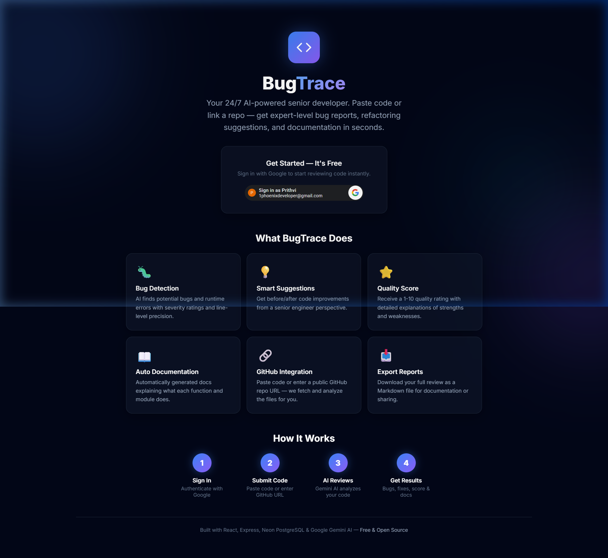
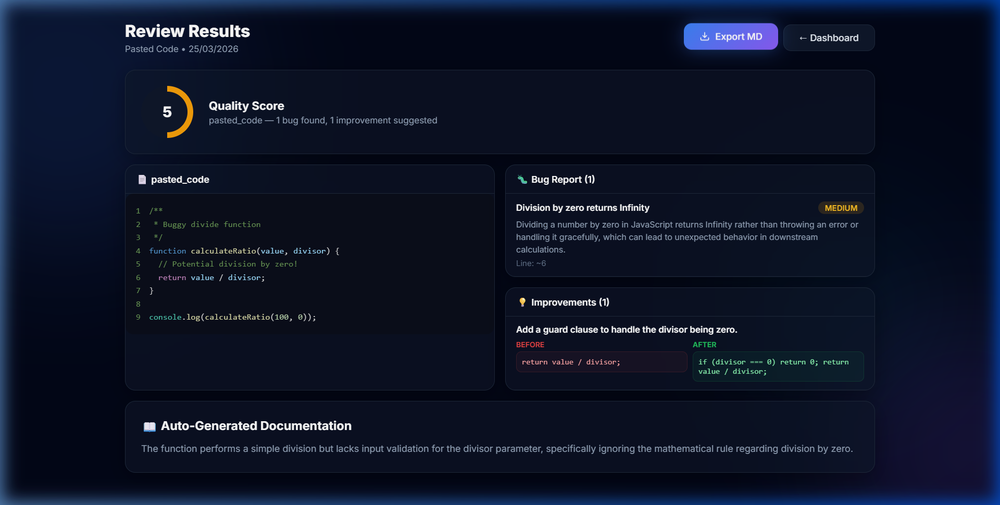

<div align="center">
  
  <h1>BugTrace</h1>
  <p><strong>Your 24/7 AI-Powered Senior Developer</strong></p>
  <p>BugTrace is a full-stack AI platform that acts as an automated code reviewer. It deeply analyzes your source code, uncovers bugs, suggests refactoring optimizations, rates code quality, and auto-generates documentation.</p>

  <a href="https://bug-trace-zeta.vercel.app"><strong>View Live Demo »</strong></a>

  <br />
  <br />

  
  
  
  

</div>

---

## 📸 Sneak Peek

### Landing Page & Dashboard
Experience a seamless, dark-themed glassmorphism design that provides a premium experience out of the box.



### Intelligent Review Results
Get comprehensive insights, severity-rated bug reports, "Before & After" code improvements, and auto-generated documentation.



---

## ✨ Features

- 🐛 **Intelligent Bug Detection:** Employs Google Gemini AI to catch logic flaws, runtime errors, and edge cases, highlighting them with specific line-level precision and severity ratings.
- 💡 **Smart Refactoring:** Don't just find issues—fix them. Get actionable "Before & After" code snippets representing modern engineering best practices.
- ⭐ **Quality Scoring System:** Receive a concrete `1-10` quality rating based on clean-code principles, security, and maintainability.
- 📖 **Auto-Documentation:** Instantly generates human-readable summaries explaining what complex functions and files actually do.
- 🔗 **GitHub Integration:** Don't want to copy-paste? Just drop a public GitHub repository URL, and BugTrace will fetch and analyze the core files automatically.
- 📥 **Export to Markdown:** Download your complete review report as a `.md` file for your team or personal notes.
- 🔐 **Secure Google OAuth:** Frictionless and secure authentication powered by Google.

---

## 🛠️ Tech Stack Architecture

**Frontend:**
- React.js + Vite for lightning-fast module replacement.
- Pure Vanilla CSS featuring an advanced, fully-responsive dark glassmorphism design system.
- Axios for API requests & React Router for navigation.

**Backend:**
- Node.js & Express.js.
- Google Gemini API (`@google/genai`) using a robust 4-model fallback chain to guarantee high availability and bypass quota limitations.
- JWT-based Session Management.

**Database:**
- Neon Serverless PostgreSQL.

---

## 🚀 Make It Your Own (Local Setup)

Want to run BugTrace locally or deploy it yourself? Follow these simple steps.

### Prerequisites
- Node.js (v18+)
- A [Neon](https://neon.tech/) PostgreSQL Database (Free tier is perfect)
- A [Google AI Studio](https://aistudio.google.com/) API Key for Gemini
- [Google Cloud Console](https://console.cloud.google.com/) OAuth Credentials (Client ID & Secret)

### 1. Clone the Repository
```bash
git clone https://github.com/CyberScythe1/BugTrace.git
cd BugTrace
```

### 2. Backend Setup
Navigate to the backend directory and install dependencies:
```bash
cd backend
npm install
```

Create a `.env` file in the `backend/` directory:
```env
PORT=5000
DATABASE_URL=postgres://your_neon_db_url
GEMINI_API_KEY=your_gemini_api_key
GOOGLE_CLIENT_ID=your_google_client_id
GOOGLE_CLIENT_SECRET=your_google_client_secret
JWT_SECRET=super_secret_jwt_string_make_it_long
```

Initialize the database schema and start the server:
```bash
node src/config/initDb.js
node server.js
```

### 3. Frontend Setup
Open a new terminal and navigate to the frontend directory:
```bash
cd frontend
npm install
```

Create a `.env` file in the `frontend/` directory:
```env
VITE_API_URL=http://localhost:5000/api
VITE_GOOGLE_CLIENT_ID=your_google_client_id
```

Start the Vite development server:
```bash
npm run dev
```

### 4. Configure Google OAuth
In your Google Cloud Console, ensure you have added the following to your **Authorized JavaScript origins**:
- `http://localhost:5173`

---

## 🌍 Deployment Guide

BugTrace is built to be deployed for free using **Vercel** and **Render**.

1. **Backend (Render / Railway):**
   - Point Render to your `backend/` root directory.
   - Set the build command to `npm install` and start command to `node server.js`.
   - Add all your backend environment variables.
   
2. **Frontend (Vercel):**
   - Point Vercel to your `frontend/` root directory.
   - Add your `VITE_GOOGLE_CLIENT_ID`.
   - Add `VITE_API_URL` pointing to your deployed Render URL (e.g., `https://your-backend.onrender.com/api`).

3. **Final CORS Tweaks:**
   - Go to `backend/server.js` and add your new Vercel URL to the `cors` origin array.
   - Add your Vercel URL to the **Authorized JavaScript origins** in Google Cloud Console.

---

## 📄 License

This project is licensed under the MIT License. Feel free to use it, modify it, and make it your own!
